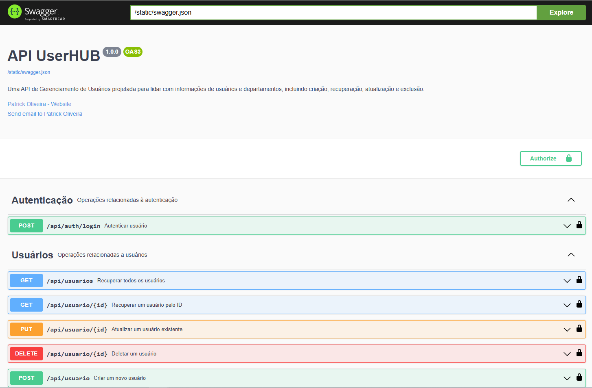

## UserHUB - Backend (MVP Pós Graduação - PUC RIO Desenvolvimento Fullstack Básico)



## Descrição do Projeto
O backend do UserHUB é responsável por gerenciar a lógica do servidor, incluindo a autenticação de usuários, o gerenciamento de dados de usuários e departamentos, e a comunicação com o banco de dados. Este projeto é construído utilizando Flask, um microframework para Python.

## Instruções de Instalação

### Pré-requisitos
- Python 3.x
- pip (gerenciador de pacotes para Python)
- virtualenv (para criar ambientes virtuais)

### Configuração do Ambiente Local

1. **Clone o Repositório:**
   ```bash
   git clone https://github.com/seu-usuario/userhub-backend.git](https://github.com/PatrickSoares-Dev/UserHub-Backend.git
   cd userhub-backend
   ```

2. **Crie um Ambiente Virtual:** Crie e ative um ambiente virtual para isolar as dependências do projeto:
   ```bash
      python3 -m venv venv
      source venv/bin/activate  # No Windows use 'venv\Scripts\activate'
   ```
3. **Instale as Dependências:** Instale todas as dependências necessárias utilizando o pip:
   ```bash
      pip install -r requirements.txt
   ```

### Configuração do Banco de Dados
- Assegure-se de configurar as variáveis de ambiente necessárias para o acesso ao banco de dados.
- Configure o banco de dados conforme as instruções no arquivo config.py (ou conforme a documentação interna do projeto).

### Comandos de Inicialização
  **Iniciar o Servidor** Para iniciar o servidor Flask, execute:
  ```bash
  flask run
  ```
  Isso iniciará o servidor de desenvolvimento na porta padrão 5000. Aplique as configurações adicionais conforme necessário no arquivo app.py ou equivalente.

### Arquitetura e Endpoints
- **Arquitetura:** O aplicativo é estruturado em módulos para facilitar a escalabilidade e manutenção. Cada funcionalidade crítica (como autenticação, gerenciamento de usuários, etc.) é encapsulada em blueprints.
- **Principais Endpoints:**
  - **/api/auth/login:** Autenticação de usuário.
  - **/api/usuarios:** Gerenciamento de usuários.
  - **/api/departamento:** Gerenciamento de departamentos.
